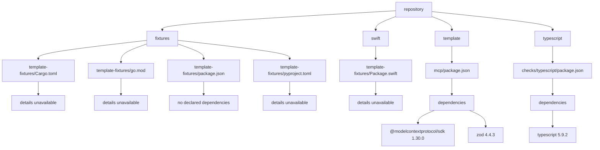

# Agent-Ready Template

Template Copier per repository GitHub-native orientati agli agenti di coding.
Fornisce governance, scope isolation, CI deterministica, controlli di
sicurezza e un digest read-only dello stato GitHub.

La specifica vincolante è [`SPEC-V1.md`](SPEC-V1.md). Le istruzioni operative
per gli agenti sono in [`AGENTS.md`](AGENTS.md); le decisioni permanenti sono in
[`DECISIONS.md`](DECISIONS.md).

## Prerequisiti

- Git
- GitHub CLI (`gh`) autenticato con permessi per creare e amministrare il
  repository destinazione
- Copier (`copier`)
- `jq`, `shellcheck` e `actionlint`
- accesso GitHub al repository template e al nuovo repository

Il bootstrap verifica anche che la versione di `gh` supporti il campo
`closingIssuesReferences`.

## Quick Start

```bash
copier copy gh:piergiorgio1999/agent-template /path/to/tuo-progetto
cd /path/to/tuo-progetto
./tools/bootstrap/bootstrap
```

Il bootstrap è fail-safe: rifiuta directory già inizializzate, repository
GitHub esistenti e configurazioni incomplete. Non esegue cancellazioni o
rollback distruttivi.

Variabili opzionali:

```bash
BOOTSTRAP_GITHUB_OWNER=owner \
BOOTSTRAP_REPO_NAME=repository \
BOOTSTRAP_VISIBILITY=private \
./tools/bootstrap/bootstrap
```

## Struttura

- `.github/`: workflow CI, Issue Forms, PR template, CODEOWNERS, label e
  configurazione Dependabot/Ruleset.
- `tools/`: i quattro tool custom e librerie condivise.
- `checks/`: checker per Shell, Go, Python, Rust, TypeScript e Swift.
- `acceptance/`: contratti ACC-01..29 e report di verifica.
- `template-fixtures/`: manifest minimi per testare il rilevamento dei linguaggi.
- `docs/`: architettura, bootstrap, validazione e release.
- `config/`, `schemas/`, `.template/`, `release/`: metadati e documentazione
  ereditati; il loro uso è tracciato in [`AUDIT.md`](AUDIT.md).

## Tool Custom

- [`scope-guard`](tools/scope-guard/scope-guard): verifica che una PR tocchi
  un solo functional scope secondo `scope-map.json`; supporta
  `scope:exception` per il caso previsto dalla SPEC.
- [`agent-config-check`](tools/agent-config-check/agent-config-check): verifica
  file fondamentali, JSON della scope map e coerenza della versione template.
- [`project-status`](tools/project-status/project-status): produce un digest
  JSON o Markdown read-only derivato da GitHub tramite `gh` e `jq`.
- [`bootstrap`](tools/bootstrap/bootstrap): crea in modo fail-safe un nuovo
  repository, pubblica il commit iniziale e applica il Ruleset.

## CI

La CI esegue, nell’ordine previsto dal contratto:

1. anti-rot e scope guard;
2. rilevamento dei linguaggi e checker pertinenti;
3. `gitleaks`, `actionlint` e `zizmor`;
4. gate unico blocking.

I checker sono no-op quando il relativo manifest non è presente. Le action
third-party sono fissate a commit SHA e i job usano permessi minimi.

Il workflow [`label-sync.yml`](.github/workflows/label-sync.yml) sincronizza
le label canoniche senza eliminare label extra.

## Aggiornare il Template

Dal repository generato:

```bash
copier update
```

Rivedi sempre il diff prima del commit. Il codice project-specific deve restare
separato dagli aggiornamenti dell’infrastruttura del template; verifica i
conflitti seguendo [`SPEC-V1.md`](SPEC-V1.md).

## Verifica Acceptance

I 29 casi sono elencati in [`acceptance/cases/`](acceptance/cases/) e il report
operativo è [`acceptance/VERIFICATION.md`](acceptance/VERIFICATION.md).
I test locali possono essere eseguiti con:

```bash
acceptance/scripts/run-scope-guard.sh
acceptance/scripts/run-anti-rot.sh
acceptance/scripts/run-digest.sh
```

I casi che richiedono GitHub Actions, Ruleset o un repository derivato devono
essere eseguiti su una risorsa disposable e non simulati localmente.

## Troubleshooting

### `missing required command: copier`

Installa Copier e ripeti il comando. Il bootstrap non prosegue se manca un
prerequisito.

### `refusing to run: .git already exists`

Il bootstrap è pensato per una directory appena generata da Copier. Usa una
directory nuova; non elimina mai un repository esistente.

### `closingIssuesReferences` non supportato

Aggiorna GitHub CLI e verifica con:

```bash
gh version
gh pr list --repo piergiorgio1999/agent-template --limit 1 \
  --json closingIssuesReferences
```

### `scope-guard: multiple scopes touched`

Controlla i file della PR rispetto a [`scope-map.json`](scope-map.json). Una
PR deve avere un solo scope, salvo la label `scope:exception` quando la
deroga è realmente necessaria.

### CI rossa su un checker

Esegui prima il checker locale pertinente da `checks/`, poi controlla i log del
job GitHub. Non aggiungere bypass: la CI è intenzionalmente blocking.

### Digest vuoto o non disponibile

Verifica autenticazione e accesso di `gh`, quindi esegui:

```bash
tools/project-status/project-status md
```

Il digest è read-only e non è una fonte di verità persistente.

## Mappe del Repository

Viste gerarchiche read-only derivate in modo deterministico dalle fonti
tracciate, senza LLM e senza servizi remoti ([`SPEC-V1.md`](SPEC-V1.md)
sez. 13). Servono a leggere il progetto a colpo d'occhio: **non sono fonti
autorevoli**. Codice, manifest, workflow, Issue, PR e Checks restano la
source of truth.

Ogni vista è disponibile in due formati equivalenti, generati dallo stesso
albero ordinato: `mermaid`, che GitHub rende come diagramma, e `outline`, che
gli agenti consumano come testo.

```bash
tools/project-status/project-status map dependencies outline
```

I blocchi statici qui sotto sono generati: non modificarli a mano. Ogni PR ne
verifica la freschezza byte per byte e fallisce se sono obsoleti; la CI non li
riscrive mai, perché un auto-commit renderebbe la vista derivata editor della
fonte da cui deriva.

La rigenerazione automatica a ogni commit è un hook git locale, installato dal
bootstrap nei repository generati e attivabile qui con:

```bash
tools/project-status/readme-maps install-hook
```

Rigenerazione manuale:

```bash
tools/project-status/readme-maps update
```

### Dipendenze dichiarate

Componenti classificati da [`scope-map.json`](scope-map.json), manifest
Git-tracciati e dipendenze dichiarate. I manifest riconosciuti ma non
analizzati in V1.2 sono marcati `details unavailable`: l'omissione silenziosa
è vietata.

<!-- repository-map:dependencies:start -->



```text
repository
  fixtures
    template-fixtures/Cargo.toml
      details unavailable
    template-fixtures/go.mod
      details unavailable
    template-fixtures/package.json
      no declared dependencies
    template-fixtures/pyproject.toml
      details unavailable
  swift
    template-fixtures/Package.swift
      details unavailable
  template
    mcp/package.json
      dependencies
        @modelcontextprotocol/sdk 1.30.0
        zod 4.4.3
  typescript
    checks/typescript/package.json
      dependencies
        typescript 5.9.2
```

<!-- repository-map:dependencies:end -->

### Flusso operativo CI

Sequenza contrattuale della sezione 9 della SPEC. È una vista del contratto,
non una DAG estratta dai workflow.

```mermaid
flowchart TD
  n0001["repository"]
  n0002["ci"]
  n0001 --> n0002
  n0003["contract view of SPEC section 9 (not an extracted workflow DAG)"]
  n0002 --> n0003
  n0004["sequence"]
  n0003 --> n0004
  n0005["01 checkout"]
  n0004 --> n0005
  n0006["02 anti-rot"]
  n0004 --> n0006
  n0007["03 actionlint"]
  n0004 --> n0007
  n0008["04 zizmor"]
  n0004 --> n0008
  n0009["05 gitleaks"]
  n0004 --> n0009
  n0010["06 paths detection"]
  n0004 --> n0010
  n0011["07 scope guard"]
  n0004 --> n0011
  n0012["08 language detection"]
  n0004 --> n0012
  n0013["09 static checks"]
  n0004 --> n0013
  n0014["10 test"]
  n0004 --> n0014
  n0015["11 build"]
  n0004 --> n0015
  n0016["12 test reporter"]
  n0004 --> n0016
  n0017["13 CI Gate"]
  n0004 --> n0017
  n0018["concurrency"]
  n0003 --> n0018
  n0019["main cancel-in-progress false"]
  n0018 --> n0019
  n0020["pull request cancel-in-progress true"]
  n0018 --> n0020
  n0021["permissions"]
  n0003 --> n0021
  n0022["GITHUB_TOKEN default contents read"]
  n0021 --> n0022
  n0023["elevations per job only"]
  n0021 --> n0023
  n0024["timeout"]
  n0003 --> n0024
  n0025["linux static 10m"]
  n0024 --> n0025
  n0026["linux test build 20m"]
  n0024 --> n0026
  n0027["macos swift 30m"]
  n0024 --> n0027
  n0028["self test 30m"]
  n0024 --> n0028
```

<!-- repository-map:ci:start -->



```text
repository
  ci
    contract view of SPEC section 9 (not an extracted workflow DAG)
      sequence
        01 checkout
        02 anti-rot
        03 actionlint
        04 zizmor
        05 gitleaks
        06 paths detection
        07 scope guard
        08 language detection
        09 static checks
        10 test
        11 build
        12 test reporter
        13 CI Gate
      concurrency
        main cancel-in-progress false
        pull request cancel-in-progress true
      permissions
        GITHUB_TOKEN default contents read
        elevations per job only
      timeout
        linux static 10m
        linux test build 20m
        macos swift 30m
        self test 30m
```

<!-- repository-map:ci:end -->

### Stato lavori

La terza vista è **live** e non compare qui: sarebbe una cache autorevole
dello stato GitHub, che la SPEC sez. 13 punto 3 vieta. È uno snapshot
read-only al momento del run, non una sincronizzazione continua.

```bash
tools/project-status/project-status map status mermaid
```

La preview corrente delle tre mappe è pubblicata anche nel job summary di
[`project-status-refresh.yml`](.github/workflows/project-status-refresh.yml),
nella vista Actions del repository.
